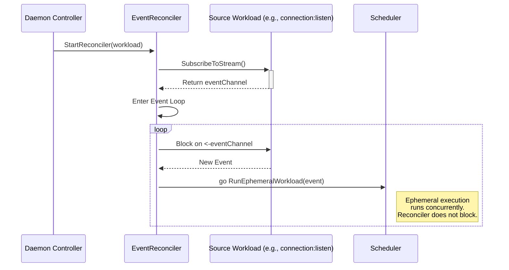
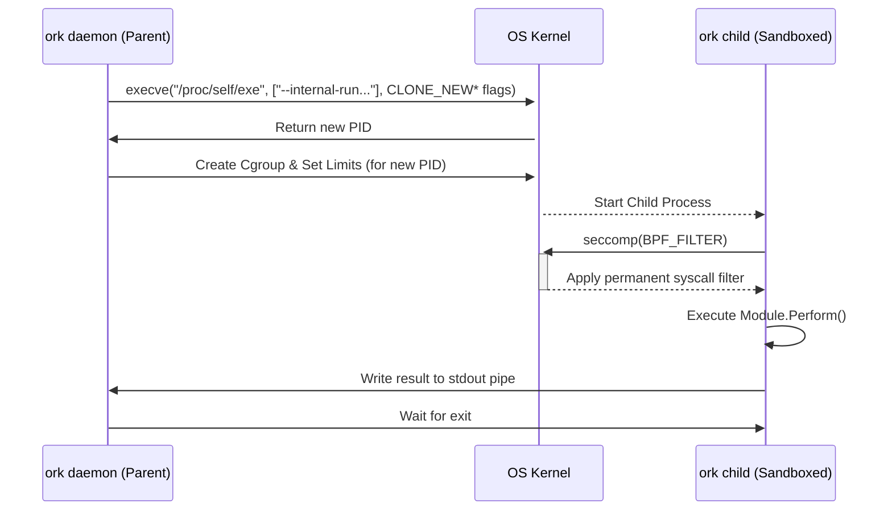

# **Ork: Architecture & Design Specification**

**Document ID:** ORK-ARCH-SPEC
**Version:** 2.0
**Status:** Approved Technical Blueprint
**Audience:** Ork Developers & Contributors, Systems Architects evaluating Ork's design.

## **Abstract**

This document provides the master technical blueprint for the `Ork` reference implementation of the Application-Layer Kernel (ALK) standard. It details the system's core design philosophy, the high-level architecture of its internal components, and the precise mechanisms by which it fulfills the six defining pillars of an ALK. Ork is a complete, unified runtime for supervised services, event-driven workflows, and streaming data pipelines. This specification serves as the canonical guide for developers and contributors, mapping the theoretical ALK standard to the concrete, engineered reality of the Ork kernel.

---

## **Part I: Core Concepts and System Overview**

### **1.1. The Ork Philosophy: An Orthogonal Implementation**

The name "Orthogonal Runtime Kernel" is a direct reflection of its core design philosophy, which is expressed across two distinct but complementary dimensions: the **orthogonality of a workload's definition** and the **orthogonality of the system's composition**. These principles are not merely stylistic choices; they are foundational architectural decisions that enable Ork's flexibility, predictability, and power, allowing it to solve a wide range of problems within a single, coherent model.

#### **1.1.1. Orthogonality of Definition: Separating Concerns within a Workload**

The first dimension of Ork's orthogonality is the strict architectural separation of a single `Workload`'s three core concerns. A `Workload` is the atomic, schedulable unit in Ork, and it is a composition of three independent, non-overlapping components:

*   **`Process` (The *What*):** An inert, reusable definition of logic. It composes a `Module` (the implementation) and its `params` (the data). A `Process` on its own is a blueprint for an action; it contains no information about how or when it should be executed and has no inherent runtime behavior.
*   **`Lifecycle` (The *How/When*):** The execution policy that the kernel applies to a `Process`. It defines whether the logic should run once (`run_once`), be kept running as a self-healing service (`supervise`), run on a schedule (`scheduled`), or react to events (`event_driven`).
*   **`Security Context` (The *Constraints*):** A declarative set of security policies and resource limits that the kernel enforces on the `Workload` at runtime. It defines the workload's blast radius and its permissions on the host system, independent of its logic or lifecycle.

These three components are designed as independent axes. A `Process` can be modified without touching its `Lifecycle`. The `Security Context` can be tightened or loosened without altering the logic or the execution policy. This separation is the primary source of reusability and clarity within Ork playbooks.

This design formally introduces the concept of **Polymorphic Workloads** as its primary benefit. This is the ability to define a single logical `Process` once and deploy it across multiple execution modalities with different security postures simply by changing declarative YAML.

**Example 1: A System Command `Process`**
Consider the following `Process`, which defines the logic for a system health check:
```yaml
process:
  module: exec
  params:
    command: /usr/local/bin/run-health-check.sh
```
This single piece of logic can be deployed across radically different operational paradigms with zero modification to the `Process` itself:

1.  **As a one-off task in a CI pipeline:** `lifecycle: { policy: run_once }`
2.  **As a supervised, self-healing service monitor:** `lifecycle: { policy: supervise, restart: on_failure }`
3.  **As a reactive handler triggered by an external alert:** `lifecycle: { policy: event_driven, source: alert_stream }`

**Example 2: An API Call `Process`**
This concept extends to any form of automation. The following `Process` defines the logic for fetching user data from an API:
```yaml
process:
  module: http:request
  params:
    url: "https://api.internal/v1/users/{{ .user_id }}"
    method: "GET"
```
This same logic can be used polymorphically:
1.  **As a step in a batch data import:** `lifecycle: { policy: run_once }`
2.  **As a continuous poller checking for user profile updates:** `lifecycle: { policy: scheduled, cron: "*/5 * * * *" }`
3.  **As an enrichment step in a security workflow:** `lifecycle: { policy: event_driven, source: siem_alert_stream }`

#### **1.1.2. Orthogonality of Composition: The Layered Module System**

The second, crucial dimension of orthogonality is realized through Ork's layered, OSI-inspired module system, the **Ork Automation Model (Ork-AM)**. This model governs the design and composition of the Ork Standard Library, ensuring that the system's capabilities are built from a set of independent, non-overlapping primitives that can be freely and reliably combined.

In the Ork-AM, modules are designed to reside in a specific layer and provide a discrete capability. A module does one thing and does it well, without needing to know the implementation details of the layers above or below it. This layered separation of concerns allows for free and reliable composition, enabling a developer to solve a problem at the most appropriate level of abstraction. This design choice provides both the convenience of high-level abstraction and the power of low-level granularity. For example, to interact with a REST API, a developer can:

*   Use a high-level **Layer 5** `http:request` module for maximum convenience, providing only a URL and parameters. They can trust that the underlying complexities of TCP connection management, socket I/O, and HTTP protocol parsing are handled correctly by the kernel and lower-level modules.
*   Or, if the requirement is to implement a custom, non-HTTP protocol, they can drop down the stack and compose low-level **Layer 2** `connection:*` modules (to manage raw TCP sockets) with **Layer 4** `data:map` modules (to parse the custom protocol's byte stream). This provides an "escape hatch" for advanced use cases without ever needing to leave the secure, observable Ork model.

The kernel's native, back-pressured **Streaming Data Plane** is the fundamental mechanism that enables these orthogonal components to be reliably connected. This high-integrity IPC fabric, detailed later in this document, functions as the "physical and data link layer" of the Ork-AM, allowing the output of one module to be piped directly to the input of another. This creates a system that is less a monolithic application and more a composable toolkit of high-integrity primitives.

#### **1.1.3. Conclusion: The Power of a Truly Orthogonal System**

These two dimensions of orthogonality—separating a workload's *definition* and providing a layered model for its *composition*—work together to create a system that is fundamentally more flexible, less complex, and more powerful than integrated frameworks or simple script runners. The separation of concerns within a workload enables logic reuse and declarative clarity, while the layered composition of modules provides both high-level convenience and low-level power, allowing Ork to address a vast range of automation challenges within a single, coherent architectural model.

### **1.2. High-Level Component Diagram & Data Flow**

The Ork kernel is a self-contained system composed of several specialized, cooperative services. A user's command, whether from the CLI or a gRPC client, initiates a flow through these components, which are orchestrated by the central `Daemon Controller` and `Scheduler`.

```mermaid
graph TD
    subgraph "User Interaction"
        A[ork ctl / API Client] -- "gRPC (mTLS)" --> B[ork daemon];
        CLI[ork run] --> B;
    end

    subgraph "Ork Kernel"
        B -- "Receives Command" --> C[Daemon Controller];

        subgraph "Control Plane & Lifecycle Management"
            D[gRPC Server];
            E[Reconciler Loops];
            F[Supervise Reconciler];
            G[Event-Driven Reconciler];
            H[Scheduled Reconciler];

            C -- "Manages" --> D;
            C -- "Manages" --> E;
            E -- "Contains" --> F;
            E -- "Contains" --> G;
            E -- "Contains" --> H;
        end

        subgraph "Ephemeral Execution Core (The 'Engine')"
            I[Scheduler & DAG Builder];
            J[Workload Runner];
            
            C -- "Delegates 'run_once' to" --> I;
            F & G & H -- "Instantiate via" --> I;
            I -- "Dispatches to" --> J;
        end

        subgraph "Shared Kernel Services"
            S1[State Store (BoltDB)];
            S2[Workspace Manager];
            S3[Module Registry & Verifier];
            S4[Channel Manager (IPC)];
            S5[Audit Logger];
        end

        J -- "Uses" --> S1 & S2 & S3 & S4 & S5;
        C -- "Uses" --> S1 & S5;
    end

    style A fill:#cde4ff,stroke:#5a96e6,stroke-width:2px;
    style CLI fill:#cde4ff,stroke:#5a96e6,stroke-width:2px;
    style B fill:#e1d5e7,stroke:#9673a6;
    style C fill:#fff2cc,stroke:#d6b656,stroke-width:3px;
    style E fill:#dae8fc,stroke:#6c8ebf;
    style I fill:#dae8fc,stroke:#6c8ebf;
    style J fill:#d5e8d4,stroke:#82b366;
    style S1,S2,S3,S4,S5 fill:#f8cecc,stroke:#b85450;
```

**Data Flow 1: Ephemeral Execution (`ork run`)**
An `ork run` command initiates an ephemeral, short-lived execution. The `ork` binary starts and immediately assumes the role of the kernel. It ingests the specified playbook file and subjects it to the rigorous validation process. Upon success, the `Scheduler & DAG Builder` component constructs the complete, immutable execution graph. The `WorkspaceManager` and `ChannelManager` then allocate all necessary resources—the filesystem sandbox and IPC channels—upfront. With the plan and resources in place, the `Scheduler` begins dispatching ready workloads to a worker pool. The `WorkloadRunner` manages the execution of each individual workload, including applying its security context and invoking the correct module. Upon terminal completion of the graph (success or failure), a final report is generated, all resources (including the workspace) are securely torn down, and the process exits with a corresponding POSIX exit code.

**Data Flow 2: Daemon-Managed Execution (`ork ctl apply`)**
An `ork ctl apply` command interacts with a long-running `ork daemon`. The client establishes a secure, mTLS-authenticated gRPC connection to the daemon's control plane. The request, containing the playbook YAML, is received by the `gRPC Server` and passed to the `Daemon Controller`. The controller validates the playbook and then performs a diff against the current set of active workloads it manages. For new or updated long-running workloads (e.g., `supervise`, `event_driven`), it delegates control to the appropriate `Reconciler` (e.g., the `Supervise Reconciler`), which then begins its infinite control loop to manage the workload's state according to its policy. The controller ensures that workloads removed from the playbook are gracefully terminated by canceling their reconciler's context.

### **1.3. The Declarative Model: From Playbook to Execution Graph**

The Ork kernel acts as an intelligent "compiler" for the declarative playbook, transforming the user's high-level intent into a rigorous, verifiable, and deterministic execution graph before any action is taken. This strict separation of a planning phase from an execution phase is a core architectural principle that guarantees predictability and prevents runtime mutations of workflow logic, which are common sources of non-deterministic behavior in script-based systems.

**The Validation Gauntlet:** Before any execution planning, a playbook must pass a rigorous, multi-step validation process. This "gauntlet" ensures that only well-formed, secure, and logically sound playbooks are accepted by the kernel, providing fast feedback to the user on syntax and structural errors. The stages are:
1.  **JSON Schema Validation:** The raw YAML is first validated against the official Ork JSON Schema. This catches basic syntax errors, incorrect data types, and misspelled keys at the earliest possible stage.
2.  **Strict Unmarshalling:** The validated YAML is then unmarshalled into Go structs with a "strict" policy. This immediately rejects any keys that are valid YAML but are not defined in the Ork schema, preventing common user errors and unintended configuration drift.
3.  **Deep Logical Validation:** Finally, the parsed struct is passed to a dedicated validator that performs a deep analysis of the playbook's semantics. This stage catches complex logical errors that cannot be expressed in a schema, such as dependency cycles, references to undefined workloads, and invalid combinations of lifecycle policies (e.g., applying a `restart_policy` to a `run_once` workload).

**The `DAGBuilder`:** Once validated, the playbook is given to the `DAGBuilder` component. Its sole responsibility is to construct the static, immutable "execution plan." It analyzes all workloads and their relationships, creating a formal Directed Acyclic Graph (DAG) where nodes represent workloads and edges represent dependencies. This plan is created once, upfront, and cannot be altered after execution begins. This architectural choice is critical for ensuring that a running workflow is deterministic and auditable.

**Automatic Dependency Inference:** A key feature of Ork's declarative model is its ability to automatically infer dependencies, which enables a more readable, less-verbose playbook syntax compared to tools requiring explicit `depends_on` keys. This makes the playbook's control flow a natural consequence of its data flow. The `DAGBuilder`'s static analysis infers two types of dependencies:
*   **State Dependencies:** The builder pre-parses all Go template strings within a playbook. If a template (e.g., in a `when` clause or `params` block) references the registered result of another workload (e.g., `{{ .workload_A.summary }}`), a state dependency edge is automatically created in the DAG from `workload_A` to the current workload. A workload will not be scheduled until all of its state dependencies have successfully completed.
*   **Stream Dependencies:** The builder parses the `stream_inputs` directive to create explicit stream dependency edges in the DAG. This signals to the `ChannelManager` to create the necessary IPC channels and ensures that the consumer workload is correctly wired to its producer.

### **1.4. Core Architectural Primitives**

The Ork kernel provides a set of powerful, user-facing abstractions as first-class citizens of the runtime. These are not implemented as modules but as intrinsic capabilities of the kernel itself, providing a secure and consistent foundation for all automation.

**`The Workspace`:** The kernel's abstraction for the filesystem. For each workflow instance, the `WorkspaceManager` creates a secure, ephemeral, and isolated directory with a cryptographically unpredictable name and `0700` permissions. This sandbox guarantees a clean filesystem for every run, prevents side effects between concurrent workflows, and ensures all temporary files and artifacts are securely erased upon completion. The `Workspace` can operate in an **`ephemeral`** mode (the default for `run_once` tasks, with guaranteed cleanup) or a **`persistent`** mode, where the directory's lifecycle is tied to a `supervise`d workload's lifecycle on the daemon, allowing services to maintain persistent on-disk state in a kernel-managed location.

**`The Streaming Data Plane`:** The native, back-pressured Inter-Workload Communication (IPC) mechanism. This is not an external message queue but a high-performance, in-memory data plane built on buffered Go channels. It enables high-throughput data flow between workloads and is the foundation of Ork's ETL and event processing capabilities. Its back-pressure guarantee is a critical stability feature: if a consumer processes data slower than a producer generates it, the connecting channel's buffer will fill. The producer's subsequent attempt to write to the channel will then block gracefully, pausing the producer until the consumer catches up. This mechanism automatically prevents uncontrolled memory growth and data loss, ensuring system stability under load without requiring complex manual flow control logic.

**`The Resume Context`:** The kernel primitive that enables stateful, interactive, human-in-the-loop workflows. When a workload executes the `control:wait_for_signal` module, it triggers a kernel-level process. The kernel generates a unique, single-use, and cryptographically secure resume token. It then takes a complete, consistent snapshot of that specific workflow instance's state and persists it to its durable store (e.g., BoltDB), associated with the token. The workload's execution is suspended, and the resume token is returned in its summary. An external operator or system can then use a client like `ork ctl resume` to send the token and a JSON payload to the daemon's control plane. The kernel validates the token, retrieves the persisted state, atomically merges the payload into the state, and finally signals its scheduler to "wake" the suspended workload, which now resumes execution with the new data available. This solves a notoriously difficult automation pattern at the architectural level.

---

## **Part II: Architectural Deep Dive: Fulfilling the Six ALK Pillars**

The architectural integrity of the Ork kernel is defined by its native fulfillment of the six pillars of the Application-Layer Kernel (ALK) standard. These pillars are not a checklist of features but a set of interdependent responsibilities that, when owned by a single, unified runtime, produce a system with unique guarantees of security, observability, and reliability. This section provides an exhaustive technical deep dive into each pillar, detailing the specific Go components, architectural patterns, and execution flows within the Ork implementation that realize these foundational responsibilities.

### **2.1. Pillar 1: Multi-Modal Workload Management**

An ALK must natively manage the execution lifecycle of its schedulable units across diverse operational paradigms. Ork achieves this through a sophisticated, dual-mode scheduling architecture that cleanly separates ephemeral, task-based execution from persistent, long-running lifecycle management. This design allows Ork to function as both a high-concurrency workflow engine and a robust service supervisor within a single, coherent model.

The core of this architecture is the division of labor between two primary components: the `engine.Scheduler` for ephemeral execution and the `daemon.Controller` for persistent reconciliation.

*   **The `engine.Scheduler`:** This component is the high-performance core responsible for executing `run_once` workloads. It operates on a static, pre-computed Directed Acyclic Graph (DAG) and dispatches ready workloads to a finite-sized worker pool. Its lifecycle is bound to a single playbook execution; it is instantiated, runs the DAG to completion, and is then destroyed. This provides a lightweight and efficient model for imperative, task-oriented workflows such as CI/CD pipelines or batch processing jobs.

*   **The `daemon.Controller`:** This component is the master control loop of the long-running `ork daemon`. Its primary responsibility is to act as a "manager of managers." When a playbook is applied to the daemon, the `Controller` inspects the `Lifecycle.Policy` of each `Workload`. It delegates `run_once` workloads to an instance of the `engine.Scheduler`, but for all other lifecycles (`supervise`, `event_driven`, `scheduled`), it assigns them to a dedicated **Reconciler**.

The **Reconciler** is a powerful architectural pattern, defined by the `daemon.Reconciler` interface. Each concrete implementation of this interface runs its own independent, infinite control loop, dedicated to enforcing the specific lifecycle policy of the workloads it manages. This interface-based design makes the kernel's lifecycle management capabilities extensible.

#### The `SuperviseReconciler` Loop

The `SuperviseReconciler` is responsible for implementing the `supervise` lifecycle, ensuring that a process is kept running indefinitely. Its control loop is a continuous cycle of state observation and action, designed for resilience.

```mermaid
sequenceDiagram
    participant C as Daemon Controller
    participant SR as SuperviseReconciler
    participant S as Scheduler
    participant W as Workload (Process)

    C->>+SR: StartReconciler(workload)
    SR->>SR: Enter Reconciliation Loop
    loop
        SR->>SR: Is process running? (No)
        SR->>+S: RunWorkload(workload)
        S->>+W: Start Process
        W-->>-S: Process Exits (Failure)
        S-->>-SR: Return Failure Result
        SR->>SR: Consult Restart Policy
        SR->>SR: Calculate Exponential Backoff Delay
        SR->>SR: time.Sleep(delay)
    end
    C->>-SR: StopReconciler()
```

When started by the `Controller`, the `SuperviseReconciler` enters its main loop. It first observes that its target process is not running and requests that the `Scheduler` instantiate the workload. If the process later terminates, the reconciler detects this state change. It consults the workload's `restart` policy and, if a restart is required, calculates a new delay using an exponential backoff algorithm with jitter. This prevents rapid crash-loops from overwhelming the system. It then waits for this delay before repeating the cycle, continuously reconciling the system's actual state toward the desired state: "this process should be running."

#### The `EventReconciler` Loop

The `EventReconciler` implements the `event_driven` lifecycle, transforming the kernel into a reactive event processor. Its control loop is designed for high-throughput, concurrent processing of asynchronous events.



Upon activation, the `EventReconciler` subscribes to the output stream of its designated `source` workload, receiving a dedicated Go channel for events. Its main loop blocks, waiting for a new event to arrive on this channel. When an event is received, the reconciler immediately spawns a *new goroutine* to handle it. Within this goroutine, it requests that the `Scheduler` run a new, completely isolated, ephemeral instance of the workload's `Process`, seeding it with the event's data. The reconciler itself does not wait for this ephemeral execution to complete; its loop immediately returns to waiting for the next event, allowing for the concurrent processing of many events in parallel.

### **2.2. Pillar 2: Verifiable Isolation Boundaries**

An ALK must enforce strong, verifiable isolation boundaries between concurrent workloads to prevent interference and ensure deterministic behavior. Ork implements this pillar through a three-tiered strategy that isolates state, the filesystem, and the network.

*   **State Isolation:** In a traditional OS, the Memory Management Unit (MMU) provides each process with a private virtual address space, preventing one process from corrupting another's memory. The Ork kernel provides a direct architectural analog for its state store. The `state.Store` implementation is wrapped by a `state.CopyOnWriteWrapper`. By default, any `Get` operation performed by a workload does not return a direct reference to the data in the store. Instead, it triggers a performant, cycle-safe deep copy of the requested data structure. The workload receives this private copy, which it can read freely. This "safe-by-default" policy guarantees that a buggy or malicious module cannot inadvertently or deliberately mutate the global state and cause non-deterministic failures in other, unrelated workloads. This immutability contract is fundamental to Ork's reliability, though a `state_policy` of `unsafe_direct_reference` can be specified for trusted, high-performance workloads to bypass this protection.

*   **Filesystem Isolation:** The kernel abstracts the host filesystem via the `engine.WorkspaceManager`, which provides each workflow instance with a secure, temporary directory. This isolation is hardened using OS-level primitives. When a `security_context` specifies `namespaces.mount: true`, the `WorkloadRunner` uses the `syscall.CLONE_NEWNS` flag when forking the workload's process. It then performs a `pivot_root` operation to make the managed workspace the root filesystem for that process. This effectively jails the workload, making it architecturally impossible for it to read or write files outside of its designated workspace, thus preventing path traversal attacks and filesystem-based side effects.

*   **Network and Process Isolation:** To prevent unmediated side-channel communication and inter-process interference, the kernel leverages additional Linux namespaces. Specifying `namespaces.net: true` will cause the workload to be started in a new network namespace (`syscall.CLONE_NEWNET`), leaving it with no network interfaces, not even a loopback device. This creates a powerful default-deny network posture. Similarly, the use of PID (`syscall.CLONE_NEWPID`) and IPC (`syscall.CLONE_NEWIPC`) namespaces prevents a workload from inspecting, signaling, or communicating with other processes on the host system via standard OS mechanisms.

### **2.3. Pillar 3: Native, Integrated Module System**

An ALK must execute external logic through a native, integrated system, analogous to an OS kernel's device driver model. This principle of native ownership is a core differentiator for Ork, which executes automation logic as trusted, in-process components rather than delegating to external scripts or workers.

The entire module system is built around a formal contract, the `plugin.Module` interface. A module is a Go component that implements this interface, with the `Perform` method serving as the primary "system call" into the module's logic. At startup, the kernel discovers all compiled-in modules and registers them with the `engine.ModuleRegistry`.

For environments where supply chain security is paramount, the `engine.ModuleVerifier` acts as a critical security gate. When enabled, it cryptographically verifies the signature of each module against a set of trusted public keys before allowing the `ModuleRegistry` to instantiate it. This prevents the execution of unauthorized or tampered code.

Critically, the kernel's architecture is designed to *enable* the layered **Ork Automation Model (Ork-AM)**. It is more than just a module runner; it provides the foundational services that modules across all layers require. For example, the kernel's `ConnectionManager` provides the low-level connection handling that Layer 2 `connection:*` modules use, which in turn are composed to build Layer 3 protocol modules like `ssh:connect`, and so on. This deep integration between the kernel's services and the module system is what allows for the powerful, orthogonal composition described in Part I.

*For a complete specification of the module contract, the `Perform` method signature, and a guide for developers, see the **`Ork Module System & Standard Library`** document.*

### **2.4. Pillar 4: Guaranteed Inter-Workload Channels (IPC)**

An ALK must provide reliable, high-throughput, native mechanisms for Inter-Workload Communication. Ork's implementation of this is its **Streaming Data Plane**, a high-performance, in-memory IPC fabric that is architecturally analogous to a Unix pipe.

This system is orchestrated by the `engine.ChannelManager`. When the `DAGBuilder` identifies a stream dependency, the `ChannelManager` instantiates a `managedChannel`, which is a buffered Go channel wrapped with policy logic. This provides a direct, in-memory path for a producer workload to stream data records to a consumer.

A key feature of this native IPC is **guaranteed back-pressure**. This mechanism is intrinsic to the use of buffered Go channels and is a critical component for system stability.

```mermaid
graph TD
    A[Producer] -- Writes Record 1 --> B{Channel (Buffer: 2)};
    A -- Writes Record 2 --> B;
    subgraph Channel State
        direction LR
        B -- Contains --> R1[Record 1];
        B -- Contains --> R2[Record 2];
    end
    C[Consumer] -- Is Slow / Blocked --> B;
    A -.->|Write Record 3 (BLOCKS)| B;
    C -- Reads Record 1 --> B;
    A -- Write Record 3 (Unblocks) --> B;
```

As the diagram illustrates, if a consumer is slow to process records, the channel's buffer will fill. The producer's next attempt to write to the channel will block the producer's goroutine, gracefully pausing it. Once the consumer reads a record and frees up buffer space, the producer's write operation will automatically unblock. This prevents a fast producer from overwhelming a slow consumer, eliminating a common source of memory exhaustion and cascading failures in streaming systems.

Furthermore, the kernel guarantees **stream completion**. This is achieved via a `sync.WaitGroup`-based mechanism. When the stream topology is built, the `ChannelManager` creates a `WaitGroup` for each producer. For every consumer that subscribes to that producer's stream, it increments the producer's `WaitGroup` counter. After a consumer has finished reading its input stream (on any path: success, failure, or cancellation), a `defer` block in the `WorkloadRunner` ensures that it calls `Done()` on the `WaitGroup` of each of its producers. The producer workload, after its `Perform` method has completed and it has closed its output channels, starts a background goroutine that calls `Wait()` on its own `WaitGroup`. This ensures that the producer workload will not transition to a `Completed` state until all of its downstream consumers have fully drained its stream and acknowledged completion, guaranteeing data integrity for the entire pipeline.

### **2.5. Pillar 5: Intrinsic Security & Resource Protection**

An ALK must natively enforce security boundaries and resource limits on its workloads. Ork's implementation of this pillar is its most critical security feature, providing robust, OS-level sandboxing for untrusted or resource-intensive workloads without requiring containerization.

The core architectural challenge is that OS-level constraints like `seccomp` and Linux namespaces are properties of a *process*, and they must be applied *before* the target code executes. Since Ork modules, by default, run as goroutines within the main daemon process, a different execution model is required to apply these constraints. Ork solves this with a **re-entrant binary fork/exec model**.

When a `Workload` is defined with a `Security Context`, the `WorkloadRunner` does not invoke the module's `Perform` method directly. Instead, it orchestrates a carefully sequenced process launch:

1.  The parent daemon process (the `WorkloadRunner`) uses `exec.Command` to execute its own binary (e.g., from `/proc/self/exe`), passing a hidden internal flag (e.g., `--internal-run-sandboxed`) and the serialized workload context.
2.  Crucially, it configures the `exec.Cmd.SysProcAttr` field with the necessary `Cloneflags` (e.g., `CLONE_NEWNS`, `CLONE_NEWPID`, `CLONE_NEWNET`) to instruct the OS kernel to create the new child process inside a new set of Linux namespaces.
3.  After the child process is started, the parent process uses its PID to create a dedicated `cgroup` slice and writes the declarative resource limits (e.g., `memory.max`, `cpu.max`) to the appropriate control files.
4.  The child process begins execution. Its *very first action*, before loading any module code, is to make the `seccomp()` system call to apply the specified BPF filter to itself. This is a one-way operation; the filter cannot be removed for the lifetime of the process.
5.  Only after the complete sandbox (namespaces, cgroups, seccomp) is established does the child process instantiate the module and invoke its `Perform` method. The result is serialized to its standard output, which is read by the parent daemon.

This sequence ensures that the user's automation logic never executes outside of its fully-hardened, least-privilege sandbox.



*For an exhaustive breakdown of this model, threat vectors, and other security controls, see the **`Ork Security Architecture`** document.*

### **2.6. Pillar 6: Authoritative Observability & Auditability**

An ALK must emit a built-in, tamper-evident, and non-bypassable telemetry stream. Ork's design achieves this by making auditing a core, non-optional kernel service.

The `kernel.AuditLogger` is a central component of the kernel. Crucially, it is not an optional sidecar or a library that modules can choose to use. Instead, it is instrumented directly at the source of truth **within the other five pillars**. The kernel's core mediation points are the sources of authoritative audit events:

*   The `Scheduler` logs scheduling decisions (`workloadScheduled`, `workloadSkipped`).
*   The `WorkloadRunner` logs the enforcement of security policies (`securityContextApplied`, `seccompProfileLoaded`).
*   The `State Store` wrapper logs all state transitions (`stateWritten`, `stateRead`).
*   The `ChannelManager` logs significant IPC events (`ipcBackpressureEngaged`).
*   The `Daemon Controller` logs all administrative actions, including the cryptographic identity of the caller from their mTLS certificate (`playbookApplied`, `workloadRemoved`).

Because a workload cannot perform any meaningful action—it cannot run, access state, send a message, or be sandboxed—without interacting with one of these kernel services, it cannot bypass this intrinsic audit mechanism. This creates a single, unified, and authoritative record of all system activity, which is the foundation of a verifiable and trustworthy system.

This audit trail is part of a broader, holistic observability strategy. The kernel's structured logger (based on Go's `slog`) is configured with a middleware `slog.Handler` that automatically injects the active OpenTelemetry `trace_id` and `span_id` into every log record. This design decision ensures that all three primary telemetry signals—logs, traces, and authoritative audit events—are automatically correlated, providing a rich, multi-faceted narrative of every execution without requiring any manual instrumentation by the module developer.

---

## **Part III: Cross-Cutting Concerns & Execution Semantics**

While the six pillars define the kernel's core responsibilities, a set of cross-cutting concerns governs the runtime behavior and execution semantics of every workload. These architectural patterns address flow control, concurrency, and state management, providing the foundational guarantees that make Ork a predictable and resilient platform. This section details the internal mechanisms that implement these semantics, moving from the "micro" execution of a single workload to the "macro" orchestration of complex, multi-paradigm playbooks.

### **3.1. Flow Control Semantics**

Flow control in Ork is managed declaratively through a set of directives that are interpreted and enforced by the kernel's `engine.WorkloadRunner`. This component is responsible for the "micro" execution of a single workload instance, translating the user's declarative intent into a precise sequence of runtime actions. This approach provides the expressive power of imperative control flow (branching, looping, retrying) without sacrificing the readability and analyzability of a declarative model.

*For a complete treatise on the user-facing model and its patterns, see the `Flow Control in G Ork` document.*

#### **Conditional Execution (`when`)**

The `when` directive provides the primary mechanism for conditional branching. Before a ready workload is dispatched to a worker goroutine for execution, its `when` clause is evaluated by the `WorkloadRunner`. This evaluation is performed against a read-only snapshot of the entire playbook state, granting the condition access to global variables, secrets, and the registered results of all previously completed workloads. The kernel's template renderer resolves the string, and the result is evaluated for "truthiness" according to a simple, well-defined rule set (e.g., `false`, `0`, and empty strings are falsy; all other values are truthy).

If the condition evaluates to `true`, the workload proceeds with its normal execution lifecycle. If it evaluates to `false`, the `WorkloadRunner` bypasses execution entirely. It immediately transitions the workload's status to `Skipped`. This is a critical architectural point: `Skipped` is a successful terminal state, not a failure. From the perspective of the `Scheduler`'s dependency graph, the workload has completed successfully. This allows any downstream workloads that depend on the skipped workload to have their dependencies satisfied, enabling the creation of optional or conditional paths within a DAG without breaking the overall workflow.

#### **Iterative Execution (`loop` and `loop_control`)**

The `loop` directive is Ork's declarative replacement for imperative `for` loops, enabling a single workload definition to be executed multiple times over a collection of items. The `WorkloadRunner` first resolves the `loop` value, which can be a literal list or a template that resolves to a list or map from the state store. It then iterates over this collection, creating a distinct, isolated execution instance of the workload's `Process` for each item.

Within each iteration, the current item is injected into the template context and made available as a loop variable (defaulting to `item`, but configurable via `loop_control.loop_var`). This allows the `params` of the module to be dynamically configured for each specific item in the collection. Concurrency is managed via the `loop_control.parallel` key; if specified, the `WorkloadRunner` uses a semaphore to limit the number of concurrently executing loop iterations, providing a simple yet powerful mechanism for parallelizing repetitive tasks.

The workload as a whole is considered complete only after all loop iterations have reached a terminal state. If a `register` directive is used, the final result stored in the state will be a list containing the summary from each successful iteration, preserving the order of the original collection. The failure semantic is strict: if any single iteration fails (after exhausting its own retries), the `WorkloadRunner` immediately cancels the context for all other active iterations and marks the entire workload as `Failed`.

#### **Resilient Execution (`retry` and `ignore_errors`)**

To build resilient workflows that can gracefully handle transient failures, the kernel provides two powerful directives managed by the `WorkloadRunner`.

The `retry` directive instructs the `WorkloadRunner` to wrap the invocation of a module's `Perform` method in a sophisticated retry loop. If `Perform` returns an error, the `WorkloadRunner` intercepts it. Instead of immediately failing the workload, it consults the retry policy. It calculates the next delay period, starting with the base `delay`, applying the `backoff_factor` for subsequent attempts, and adding a random percentage of that delay based on the `jitter` value to prevent thundering herd problems against a recovering downstream service. The runner then pauses for the calculated duration before re-invoking the `Perform` method. This cycle repeats up to the configured number of `attempts`. The workload only transitions to a `Failed` state if all attempts are exhausted.

If a workload ultimately fails, the `ignore_errors: true` directive alters the behavior of the main `Scheduler`. While the `WorkloadRunner` still authoritatively records the workload's status as `Failed` in the state store, this failure is treated as non-fatal *to the playbook as a whole*. The `Scheduler` will not halt the entire execution graph and will continue to schedule other independent branches of the DAG that do not depend on the failed workload, enabling the creation of non-critical, "best-effort" automation steps.

### **3.2. Concurrency and State Model**

Ork is a highly concurrent system designed from the ground up for safe and efficient parallel execution. Its concurrency model and state management guarantees are not afterthoughts but are woven into the core architecture of the kernel.

The primary execution of `run_once` workloads is managed by a **worker pool** of a fixed size. This pool is implemented using a finite number of goroutines, with concurrency limited by a semaphore. This design prevents a playbook with a large number of parallelizable workloads from overwhelming the host system with an unbounded number of threads.

The **`Scheduler` is decoupled from the workers** via Go channels. The main scheduling loop identifies workloads whose dependencies have been satisfied and places them onto a `workQueue` channel. The worker goroutines are simple consumers that block, waiting for work to arrive on this channel. This channel-based communication avoids the need for complex locking and shared state between the central scheduler and the distributed workers, resulting in a cleaner and more performant design.

The most critical architectural guarantee of the system is the **Immutability Contract** for state management. As detailed in Pillar 2, the kernel's `state.CopyOnWriteWrapper` ensures that, by default, all workloads receive a deep copy of any state they read. This "safe-by-default" model provides strong guarantees of state isolation, preventing data corruption and non-deterministic race conditions. This is a foundational pillar of Ork's reliability. However, for trusted, high-performance, data-intensive workloads where the overhead of deep copying may be a concern, the system provides a policy-driven escape hatch. By setting a `state_policy` of `unsafe_direct_reference`, an operator can instruct the kernel to bypass the deep copy mechanism and provide the workload with a direct pointer to the data in the state store. This breaks the immutability contract and places the responsibility for state safety on the module developer, but it provides a necessary tool for performance tuning in well-understood and trusted scenarios.

### **3.3. The Lifecycle of a Workload: A Narrative Walkthrough**

The following narratives synthesize the architectural concepts from Parts I and II by walking through the execution of two canonical, real-world examples. These stories illustrate how the kernel's components and primitives interoperate to realize complex, multi-paradigm automation.

#### **Example 1: A Multi-Stage CI/CD Pipeline (`run_once`)**

A CI/CD pipeline is initiated via `ork run -f ci.ork.yaml`.
1.  **Planning:** The kernel validates the playbook and the `DAGBuilder` constructs the execution graph. It identifies two workloads, `build_backend` and `build_frontend`, with no incoming dependencies. It also sees a `test_barrier` workload with `stream_inputs` from both build workloads, creating two stream dependency edges. Finally, it sees a `deploy_staging` workload with a `when` clause that references the `test_barrier`, creating a state dependency edge. The `WorkspaceManager` creates a single, ephemeral workspace, `/tmp/ork-ws-xyz`, for the entire pipeline.
2.  **Fan-Out:** The `Scheduler` places both `build_backend` and `build_frontend` into the `workQueue`. Two idle workers pick them up and begin executing them concurrently. Both workloads run inside the same workspace, allowing them to, for example, check out source code into a shared directory.
3.  **Fan-In:** As the build workloads complete, they signal their stream channels as closed. The `test_barrier` workload, which has been running concurrently, has its `sync.WaitGroup` counter decremented. Its `Perform` method, which has been blocking on `wg.Wait()`, unblocks only after both build workloads have successfully completed and signaled their completion. The barrier itself then completes.
4.  **Sequential Stage:** The completion of the `test_barrier` satisfies the state dependency for the `deploy_staging` workload. The `Scheduler` now sees it as ready and dispatches it. The `deploy_staging` workload executes its logic, potentially using artifacts created in the workspace by the earlier build stages.
5.  **Teardown:** Upon the successful completion of the deployment, the entire DAG is in a terminal state. The kernel generates a final execution report, and the `WorkspaceManager` performs a secure, recursive deletion of `/tmp/ork-ws-xyz`, guaranteeing that no build artifacts are left behind. The `ork run` process exits with code 0.

#### **Example 2: A Resilient, Observable Service (`supervise` & `event_driven`)**

An operator applies a service playbook via `ork ctl apply -f service.ork.yaml`.
1.  **Reconciliation:** The `Daemon Controller` receives the playbook. It identifies a `web_server` workload with a `supervise` lifecycle and a `log_processor` workload with an `event_driven` lifecycle whose `source` is a log stream. The controller delegates the `web_server` to the `SuperviseReconciler` and the `log_processor` to the `EventReconciler`.
2.  **Service Startup:** The `SuperviseReconciler` begins its loop, sees the `web_server` is not running, and requests that the `Scheduler` start it. The web server process starts and begins serving traffic and writing log files to its persistent workspace.
3.  **Failure & Recovery:** The `web_server` process encounters a fatal error and crashes. The `SuperviseReconciler`'s monitoring logic immediately detects the non-zero exit code. It consults the `restart: on_failure` policy, calculates a 2-second backoff delay, and logs a "restarting" event. After the delay, it re-invokes the `Scheduler` to start a new instance of the web server, which successfully comes online.
4.  **Reactive Processing:** In parallel, the `log_processor`'s `EventReconciler` has been subscribed to the log stream. It receives events for the error logs generated by the crashed server. For each log line event, it instantiates a new, ephemeral `log_processor` pipeline. This pipeline might parse the log, enrich it with metadata, and use the `http:request` module to send a high-priority alert to an external monitoring system. This entire reactive flow happens concurrently with, and is not blocked by, the `SuperviseReconciler`'s recovery actions.
This composite pattern demonstrates the power of Ork's unified model, where a single declarative file can define both the resilient, self-healing behavior of a core service and the complex, real-time, event-driven automation that observes and responds to that service's behavior.

